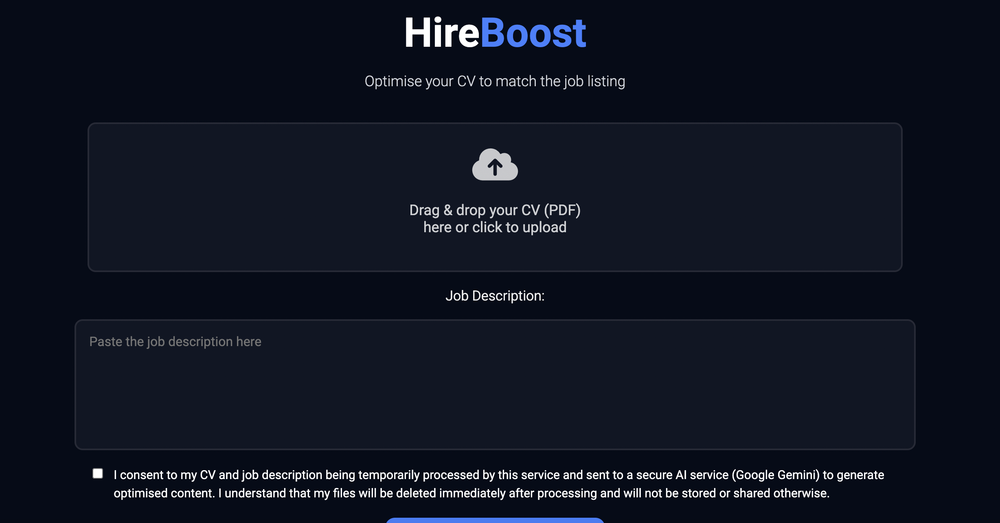
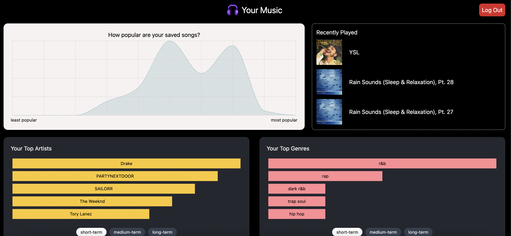

# 🐐 Ananya Chennadi

`BSc Computer Science @ Uni of Surrey`

## About Me
- Predicted First Class, excelling in core modules such as Java Fundamentals (94%)
- Love experimenting with new tools and technologies, exploring what’s possible, and turning ideas into working projects
- Gained insights at Microsoft and Sky into AI workflows, Agile development, and software engineering practices
- Former Co-Social Media Manager for Telugu Society, driving participation and engagement across 100+ members
- Currently exploring Django, experimenting with SQL databases, and diving into ML basics

---

## Skill stack

**Also comfortable with**: Data structuring (JSON and API responses), Authentication (OAuth 2.0), Production Deployment (Render, Vercel).

---

## Projects - showcase

<table>
  <tr>
    <td align="center" width="33%">
      
       
      <b>AI-powered CV Optimiser</b> 
      LLM-powered CV optimiser that tailors your CV to a specific job description.  
      🔗 <a href="https://github.com/ananyachennadi/hire-boost.git">Repo</a>
       
      Tags: AI, LLMs, Prompt Engineering
    </td>
    <td align="center" width="33%">
      
       
      <b>Spotify Visualisation Dashboard</b> 
      Dashboard that visualises your Spotify listening habits. 
      🔗 <a href="https://github.com/ananyachennadi/spotify-insights.git">Repo</a>
       
      Tags: Spotify API, OAuth 2.0, Visualisation
    </td>
      </tr>
</table>

---

## Stats

## Connect with me

<table>
  <tr>
    <td>
      
    </td>
    <td>
      
    </td>
  </tr>
</table>

